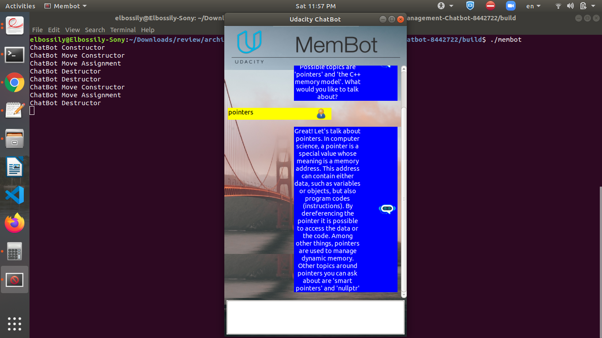
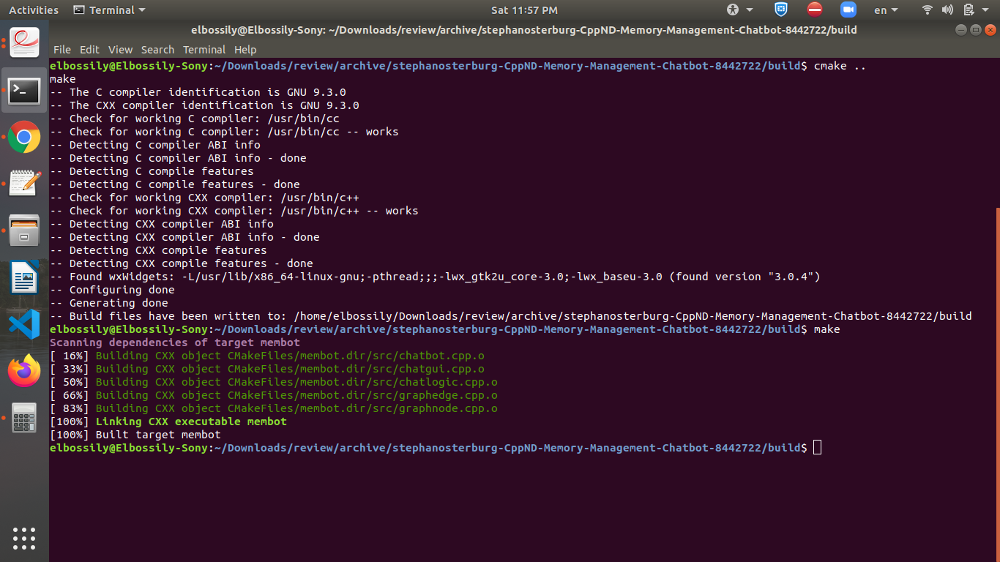
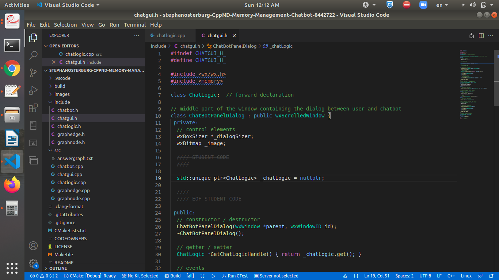
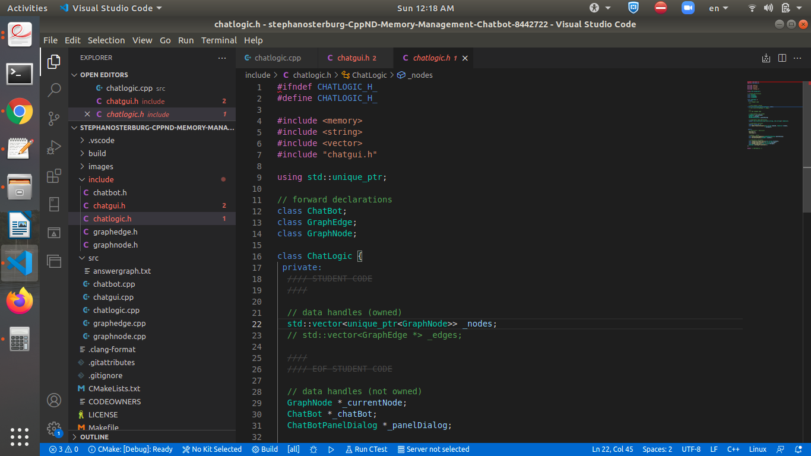
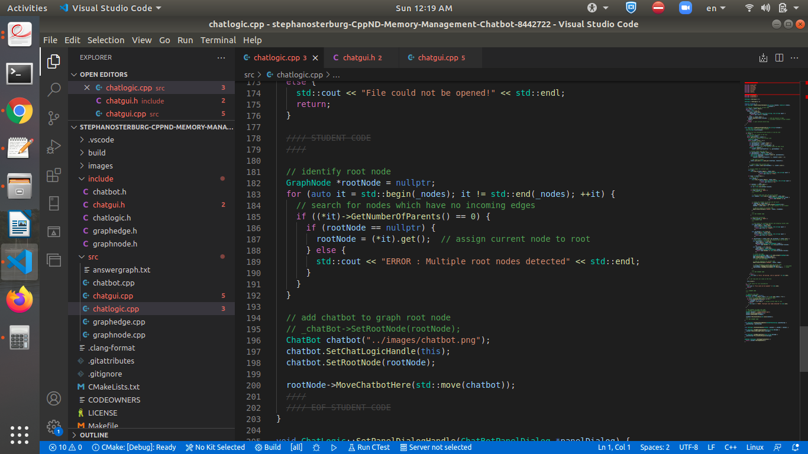
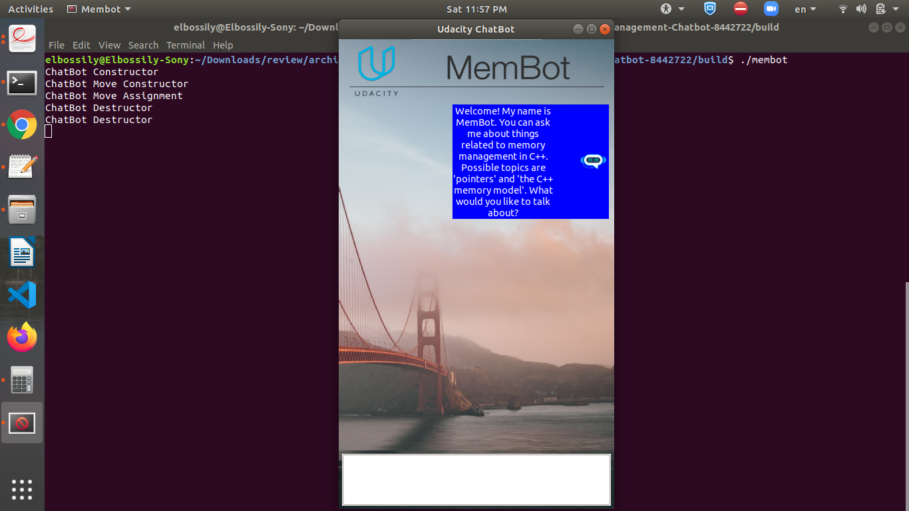

# Memory Management Chatbot

## Meets Specications 

## Dear Student

You did a great job, and your project is clearly administrating your strong understanding of smart pointers.

* Well done for making a deep copy for the memory in the heap for the copy methods
* Great work for making a shallow copy for the memory in the heap for the move methods
* Well done for using the move semantics properly in moving the edge and chatbot instances from chatlogic class. 
* Great work of defining \_chatLogic as a unique pointer.

**Quick revision for the the difference between the shallow and deep copying**
* There are two different types of copying.
* The first is the shallow copying, which is commonly used in the move operator method. 
  EX:
  ```
  \_image = source.\_image;
  ```
* The second is a deep copying, which is commonly used for copying the memory in the heap in the copy operator method. 
  Ex:
  ```
  \_image = new wxBitmap(\*source.\_image);
  ```
**Some useful links**

* Check [this link](http://net-informations.com/faq/net/shallow-deep-copy.htm) for more information about shallow copying and deep copying and when you should use them.
* Read [this page](https://www.geeksforgeeks.org/smart-pointers-cpp/). It contains useful information about the idea of smart pointers.



## Quality of Code

The code compiles and runs with  **cmake** and  **make** .

* **Your code compiles without any errors** 
* Here are some useful links for the Make file topic, you will need it entire life being a software engineer!
  * [How to Build a CMake-Based Project](https://preshing.com/20170511/how-to-build-a-cmake-based-project/)
  * [Introduction to CMake by Example](http://derekmolloy.ie/hello-world-introductions-to-cmake/)
  * [Cmake tutorial](https://cmake.org/cmake/help/latest/guide/tutorial/index.html)



## Task 1: Exclusive Ownership 1

In file **chatgui.h / chatgui.cpp**, **_chatLogic** is made an exclusive resource to class **ChatbotPanelDialog** using an appropriate smart pointer. Where required, changes are made to the code such that data structures and function parameters reflect the new structure.

* _chatLogic was defined as a unique pointer well done :thumbsup:
* Save [this link](https://www.geeksforgeeks.org/auto_ptr-unique_ptr-shared_ptr-weak_ptr-2/) in you notebook, it contains all you need about the unique pointer



## Task 2: The Rule of Five

In file **chatbot.h / chatbot.cpp**, changes are made to the class **ChatBot** such that it complies with the Rule of Five. Memory resources are properly allocated / deallocated on the heap and member data is copied where it makes sense. In each of the methods (e.g. the copy constructor), a string of the type "ChatBot Copy Constructor" is printed to the console so that it is possible to see which method is called in later examples.

* Well done for making a deep copy for the memory in the heap for the copy methods 
* Great work for making a shallow copy for the memory in the heap for the move methods|

## Task 3: Exclusive Ownership 2

In file **chatlogic.h / chatlogic.cpp**, the vector **_nodes** are adapted in a way that the instances of GraphNodes to which the vector elements refer are exclusively owned by the class **ChatLogic**. An appropriate type of smart pointer is used to achieve this.

`\_nodes` was defined as a vector of unique pointers. Well done



When passing the **GraphNode** instances to functions, ownership is not transferred.

Well done for using the reference here to pass the graphnode to the lambada function
```
auto parentNode = std::find_if(_nodes.begin(), _nodes.end(), [&parentToken](std::unique_ptr<GraphNode>& node) { return node->GetID() == std::stoi(parentToken->second); })

auto childNode = std::find_if(_nodes.begin(), _nodes.end(), [&childToken](std::unique_ptr<GraphNode>& node) { return node->GetID() == std::stoi(childToken->second); });
```

## Task 4: Moving Smart Pointers


In files **chatlogic.h / chatlogic.cpp** and **graphnodes.h / graphnodes.cpp** all instances of **GraphEdge** are changed in a way such that each instance of **GraphNode** exclusively owns the outgoing **GraphEdges** and holds non-owning references to incoming **GraphEdges**. Appropriate smart pointers are used to do this. Where required, changes are made to the code such that data structures and function parameters reflect the changes.

Well done for using the unique pointer here with the edge

```
std::unique\_ptr<GraphEdge> edge = std::make\_unique<GraphEdge>(id);
```

In files **chatlogic.h / chatlogic.cpp** and **graphnodes.h / graphnodes.cpp**, move semantics are used when transferring ownership from class ChatLogic, where all instances of **GraphEdge** are created, into instances of **GraphNode**.
* Well done for using the move semantics here.
* By doing that chatlogic class will no longer have any ownership for GraphEdge instances

## Task 5: Moving the ChatBot

In file  **chatlogic.cpp** , a local  **Chat Bot** instance is created on the stack at the bottom of function**LoadAnswerGraphFromFile** and move semantics are used to pass the  **ChatBot** instance into the root node.

* Great work for creating the  `chatbot` instance in the stack.
* Check [this link](https://www.geeksforgeeks.org/stack-vs-heap-memory-allocation/) for more information about the differences between heap and stack memory



**ChatLogic** has no ownership relation to the **ChatBot** instance and thus is no longer responsible for memory allocation and deallocation.

By using the move semantics here chatlogic became no longer responsible for memory allocation and deallocation of the ChatBot instance that you have declared in the stack

```
rootNode->MoveChatbotHere(std::move(chatBot));
```

When the program is executed, messages are printed to the console indicating which Rule of Five component of  **ChatBot** is being called.

The expected messages were printed on the screen.


